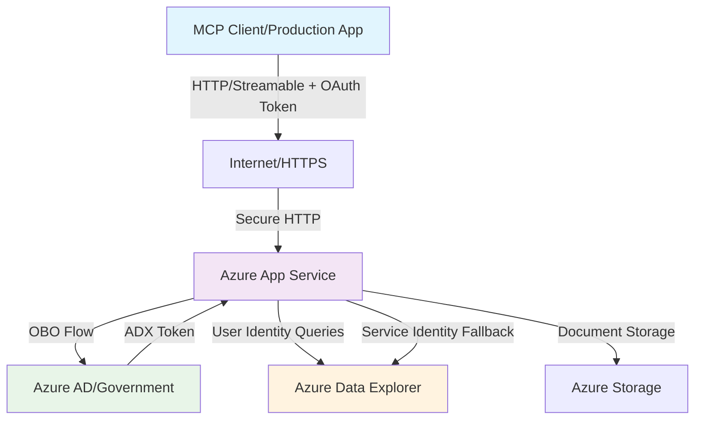
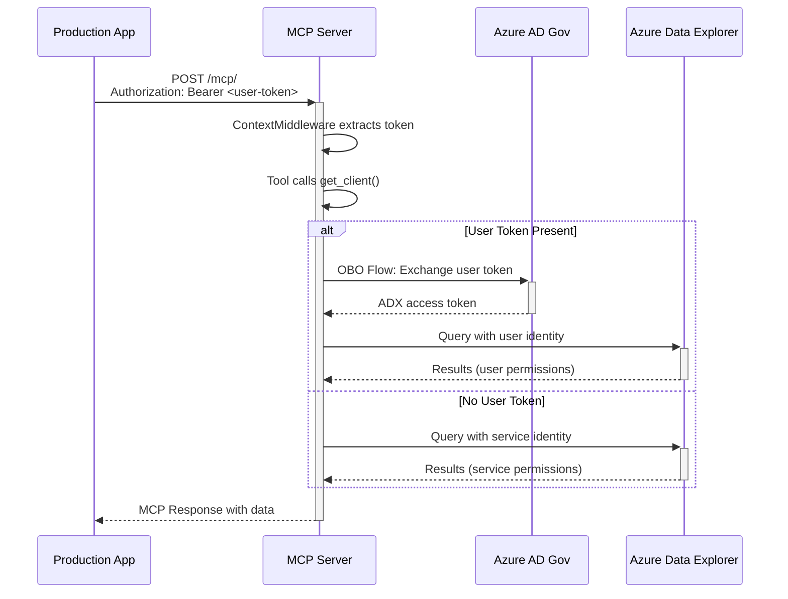

# 🏗️ Rude MCP Server - Architecture & Developer Guide

This document provides a comprehensive overview of the Rude MCP Server architecture, designed to help developers understand the implementation, OAuth token handling, and deployment on Azure App Service.

## 📋 Table of Contents

- [Architecture Overview](#architecture-overview)
- [Key Components](#key-components)
- [OAuth Token Flow](#oauth-token-flow)
- [Deployment Architecture](#deployment-architecture)
- [Code Structure](#code-structure)
- [Authentication Modes](#authentication-modes)
- [Developer Onboarding](#developer-onboarding)

## 🏗️ Architecture Overview



### Core Architecture Principles

- **🌐 Internet-Accessible**: Deployed on Azure App Service with HTTPS endpoints
- **🔄 MCP Protocol**: Implements Model Context Protocol over HTTP (Streamable transport)
- **🔐 OAuth 2.0 Ready**: Supports bearer tokens with automatic user impersonation
- **🏢 Hybrid Authentication**: Service identity fallback for backwards compatibility
- **📊 Multi-Service**: Integrates ADX, Azure Storage, fictional APIs, and math tools

## 🔑 Key Components

### 1. 🚀 Server Initialization & MCP Protocol Setup

**📍 File: [`main.py`](../main.py) Lines 81-98**

```python
# Initialize FastMCP server
logger.info("🔧 Initializing FastMCP server...")
mcp = FastMCP("Rude MCP Server")

# Register all tools
logger.info("📋 Registering tools...")
register_math_tools(mcp)      # ➕ Mathematical operations
register_adx_tools(mcp)       # 📊 Azure Data Explorer integration
register_fictional_api_tools(mcp)  # 🎭 Demo API tools
register_document_tools(mcp)  # 📄 Document search tools
```

**📍 File: [`main.py`](../main.py) Line 198**
```python
# Create HTTP app for streamable transport
app = mcp.http_app()
```

**🔑 Key Insight**: This creates the **MCP-over-HTTP server** that serves the protocol on the internet using FastMCP's streamable transport.

### 2. 🔐 OAuth Token Extraction & Context Management

**📍 File: [`context.py`](../context.py) Lines 7-9**

```python
# Context variables to store request data across the application
current_user_id: ContextVar[str] = ContextVar('current_user_id', default='defaMCPUser')
current_session_id: ContextVar[str] = ContextVar('current_session_id', default=None)
current_user_token: ContextVar[str] = ContextVar('current_user_token', default=None)  # 🔑 OAuth token
```

**📍 File: [`main.py`](../main.py) Lines 67-80**
```python
class ContextMiddleware(BaseHTTPMiddleware):
    """Middleware to extract and store request context from headers"""
    
    async def dispatch(self, request: Request, call_next):
        # Extract user context from headers for ALL requests (including MCP)
        user_id = request.headers.get("X-User-ID") or request.headers.get("x-user-id") or "defaMCPUser"
        session_id = request.headers.get("X-Session-ID") or request.headers.get("x-session-id")
        
        # 🔑 Extract bearer token from Authorization header
        auth_header = request.headers.get("Authorization")
        user_token = None
        if auth_header and auth_header.startswith("Bearer "):
            user_token = auth_header[7:]  # Remove "Bearer " prefix
        
        # Store in context variables for use throughout the request
        current_user_id.set(user_id)
        if session_id:
            current_session_id.set(session_id)
        if user_token:
            current_user_token.set(user_token)  # 🎯 Makes token available to all tools
```

**🔑 Key Insight**: Every HTTP request is **automatically processed** to extract OAuth tokens from `Authorization: Bearer <token>` headers.

### 3. 🔄 User Impersonation & On-Behalf-Of Flow

**📍 File: [`tools/adx_tools.py`](../tools/adx_tools.py) Lines 159-219**

```python
def get_client(self) -> KustoClient:
    """Dynamic authentication: user impersonation OR service identity"""
    try:
        # 🔍 Check if we have a user token for impersonation
        user_token = current_user_token.get(None)
        
        if user_token:
            # 🔐 USER IMPERSONATION MODE
            logger.info("Using user impersonation for Kusto client")
            return self._get_user_impersonated_client(user_token)
        else:
            # 🏢 SERVICE IDENTITY MODE
            logger.info("No user token available, using service identity")
            return self._get_service_client()
    except Exception as e:
        # 🛡️ FALLBACK: Always fall back to service identity
        logger.error(f"Error getting Kusto client: {e}")
        return self._get_service_client()
```

**📍 File: [`tools/adx_tools.py`](../tools/adx_tools.py) Lines 55-111**
```python
class OnBehalfOfCredential:
    """Custom credential class for On-Behalf-Of flow using MSAL"""
    
    def get_token(self, *scopes, **kwargs):
        # 🌐 Use Azure Government endpoint for government clouds
        authority_base = os.getenv("AZURE_AUTHORITY_HOST", "https://login.microsoftonline.us")
        app = msal.ConfidentialClientApplication(
            self.client_id,
            authority=f"{authority_base}/{self.tenant_id}",
            client_credential=self.client_secret
        )
        
        # 🎯 Request token for ADX specifically
        adx_scope = "https://kusto.kusto.usgovcloudapi.net/.default"
        result = app.acquire_token_on_behalf_of(
            user_assertion=self.user_assertion,  # User's original token
            scopes=[adx_scope]                   # ADX-specific scope
        )
```

**🔑 Key Insight**: The system **automatically detects** OAuth tokens and **seamlessly switches** between user impersonation and service identity.

### 4. 🌐 HTTP Server & Internet Transport

**📍 File: [`main.py`](../main.py) Lines 236-259**

```python
if __name__ == "__main__":
    # 🌐 Configure CORS for web clients
    configure_cors(app)
    
    # 🔧 Add context middleware for request processing
    app.add_middleware(ContextMiddleware)
    
    # 📊 Production deployment info
    logger.info("=== Rude MCP Server - Production Ready ===")
    logger.info(f"🌐 Server URL: https://your-app-service.azurewebsites.net/mcp/")
    logger.info(f"🔧 Transport: Streamable HTTP (JSON-RPC over HTTP)")
    logger.info(f"🔒 Authentication: OAuth 2.0 Bearer Tokens + OBO Flow")
    
    # 🚀 Start server (handled by Azure App Service in production)
    import uvicorn
    uvicorn.run(app, host="0.0.0.0", port=int(os.getenv("PORT", "8000")))
```

**📍 File: [`startup.py`](../startup.py) Lines 69-100**
```python
# 🏭 Azure App Service production startup with Gunicorn
from main import app
import gunicorn.app.wsgiapp as wsgi

# Configure gunicorn for production deployment
sys.argv = [
    "gunicorn",
    "--bind", f"0.0.0.0:{port}",
    "--workers", "1",                                    # Single worker for MCP
    "--worker-class", "uvicorn.workers.UvicornWorker",  # ASGI support
    "main:app"                                           # FastAPI app
]
wsgi.run()
```

### 5. 🛠️ Tool Registration & MCP Protocol Implementation

**📍 File: [`tools/adx_tools.py`](../tools/adx_tools.py) Lines 286-307**

```python
def register_adx_tools(mcp: FastMCP):
    """Register all Azure Data Explorer tools with the FastMCP server"""
    
    @mcp.tool
    async def kusto_get_auth_info() -> Dict[str, Any]:
        """🔍 Get information about the current authentication mode for ADX"""
        user_token = current_user_token.get(None)  # 🔑 Access token from context
        
        auth_info = {
            "has_user_token": bool(user_token),
            "authentication_mode": "user_impersonation" if user_token else "service_identity",
            "cluster_url": get_kusto_manager().config.cluster_url
        }
        
        if user_token:
            auth_info["token_preview"] = f"{user_token[:20]}..."  # Safe preview
            # 🔧 Check OBO configuration status
            obo_vars = {
                "AZURE_TENANT_ID": bool(os.getenv("AZURE_TENANT_ID")),
                "AZURE_CLIENT_ID": bool(os.getenv("AZURE_CLIENT_ID")),
                "AZURE_CLIENT_SECRET": bool(os.getenv("AZURE_CLIENT_SECRET"))
            }
            auth_info["obo_config"] = obo_vars
            auth_info["obo_ready"] = all(obo_vars.values())
        
        return auth_info
```

**🔑 Key Insight**: Each tool is **automatically registered** with the MCP protocol and can **seamlessly access** the OAuth token context.

## 🔐 OAuth Token Flow

### Client → Server → ADX Flow



### Authentication Decision Logic

```python
# 🎯 This logic runs for EVERY ADX tool call:
user_token = current_user_token.get(None)

if user_token:
    # 🔒 USER IMPERSONATION MODE
    # ✅ Decode token to check if it's already for ADX
    # ✅ If ADX token: use directly with SimpleTokenCredential
    # ✅ If not ADX token: use OnBehalfOfCredential with OBO flow
    # ✅ Query ADX with user's identity and permissions
    credential = create_user_credential(user_token)
else:
    # 🏢 SERVICE IDENTITY MODE  
    # ✅ Use ManagedIdentityCredential (in Azure)
    # ✅ Use DefaultAzureCredential (locally)
    # ✅ Query ADX with service identity and permissions
    credential = create_service_credential()

# 🎯 Same KustoClient, different credentials
client = KustoClient(credential)
```

## 🌐 Deployment Architecture

### Internet Accessibility

**MCP Endpoint**: `https://your-app-service.azurewebsites.net/mcp/`

- ✅ **Protocol**: MCP over HTTP (Streamable transport)
- ✅ **Security**: HTTPS with OAuth 2.0 bearer tokens
- ✅ **CORS**: Configured for web client access
- ✅ **Production**: Gunicorn + Uvicorn workers

### Azure App Service Configuration

**📍 File: [`.env`](../.env) - Environment Variables**

```bash
# 📊 ADX Configuration
KUSTO_CLUSTER_URL=https://cluster.usgovvirginia.kusto.usgovcloudapi.net
KUSTO_DEFAULT_DATABASE=Personnel

# 🔐 OAuth & OBO Configuration
AZURE_TENANT_ID=03f141f3-496d-4319-bbea-a3e9286cab10
AZURE_CLIENT_ID=5e9822c5-f870-4acb-b2e6-1852254d9cbb
AZURE_CLIENT_SECRET=***
AZURE_AUTHORITY_HOST=https://login.microsoftonline.us  # Azure Government

# 🌐 Server Configuration
CORS_ENABLED=true
CORS_ORIGINS=*  # ⚠️ Use specific origins in production
```

### CORS & Security Setup

**📍 File: [`main.py`](../main.py) Lines 170-190**

```python
def configure_cors(app):
    """🌐 Configure CORS middleware for web clients"""
    cors_origins = get_cors_origins()
    cors_enabled = os.getenv("CORS_ENABLED", "true").lower() == "true"
    
    if cors_enabled:
        app.add_middleware(
            CORSMiddleware,
            allow_origins=cors_origins,           # ✅ Configurable origins
            allow_credentials=True,               # ✅ Allow auth headers
            allow_methods=["GET", "POST", "PUT", "DELETE", "OPTIONS"],
            allow_headers=["*"],                  # ✅ Allow Authorization header
        )
```

## 📂 Code Structure

### File Organization

```
Rude-MCPServer/
├── 📄 main.py                 # Server initialization, middleware, HTTP setup
├── 📄 context.py              # Request context management (OAuth tokens)
├── 📄 startup.py              # Azure App Service production startup
├── 📄 requirements.txt        # Dependencies (FastMCP, MSAL, Azure SDKs)
├── 🗂️ tools/
│   ├── 📄 __init__.py         # Tool registration exports
│   ├── 📄 adx_tools.py        # ADX integration with OBO flow ⭐
│   ├── 📄 math_tools.py       # Mathematical operations
│   ├── 📄 document_tools.py   # Azure Storage document search
│   └── 📄 fictional_api_tools.py  # Demo API integration
├── 🗂️ docs/
│   ├── 📄 OBO_Authentication.md     # OBO flow documentation
│   └── 📄 Architecture_README.md   # This file
└── 📄 test_obo_setup.py       # Setup verification script
```

### Key Files for Developers

| File | Purpose | Key Concepts |
|------|---------|--------------|
| [`main.py`](../main.py) | 🚀 Server initialization, middleware, HTTP setup | FastMCP, ContextMiddleware, CORS, Streamable HTTP |
| [`context.py`](../context.py) | 🔐 Request context management | ContextVar, OAuth token storage, request scoping |
| [`tools/adx_tools.py`](../tools/adx_tools.py) | 📊 ADX integration with OBO flow | OnBehalfOfCredential, user impersonation, fallback |
| [`startup.py`](../startup.py) | 🏭 Azure App Service production startup | Gunicorn, ASGI workers, production deployment |

## 🔄 Authentication Modes

### Mode 1: Service Identity (Default/Fallback)

```python
# 🏢 When no OAuth token is provided
credential = ManagedIdentityCredential()  # In Azure
# OR
credential = DefaultAzureCredential()     # Locally

# ✅ Characteristics:
# - Uses Azure App Service Managed Identity
# - Backward compatible with existing clients
# - Service-level permissions to ADX
# - Simpler for basic scenarios
```

### Mode 2: User Impersonation (OAuth + OBO)

```python
# 🔐 When OAuth token is provided in Authorization header
if is_adx_token(user_token):
    credential = SimpleTokenCredential(user_token)       # Direct ADX token
else:
    credential = OnBehalfOfCredential(                   # OBO flow
        tenant_id=AZURE_TENANT_ID,
        client_id=AZURE_CLIENT_ID,
        client_secret=AZURE_CLIENT_SECRET,
        user_assertion=user_token
    )

# ✅ Characteristics:
# - User-level permissions to ADX
# - Audit trails show actual user
# - Row-level security support
# - Compliance-friendly
```

### Authentication Decision Matrix

| Scenario | Token Present | Authentication Mode | ADX Access Level |
|----------|---------------|-------------------|------------------|
| Production App → MCP Server | ✅ Yes | 🔐 User Impersonation | User permissions |
| Legacy Client → MCP Server | ❌ No | 🏢 Service Identity | Service permissions |
| MCP Inspector → MCP Server | ✅ Yes (OAuth) | 🔐 User Impersonation | User permissions |
| Health Check → MCP Server | ❌ No | 🏢 Service Identity | Service permissions |

## 🎯 Developer Onboarding

### For New Developers

#### 1. **Start with [`main.py`](../main.py)**
- Understand how FastMCP creates an HTTP server
- See how middleware processes OAuth tokens
- Learn about CORS and production configuration

#### 2. **Study [`context.py`](../context.py)**
- Learn how OAuth tokens flow through requests
- Understand ContextVar for request-scoped data
- See how user context is managed

#### 3. **Deep Dive [`tools/adx_tools.py`](../tools/adx_tools.py)**
- Real-world On-Behalf-Of implementation
- Dynamic authentication switching
- Error handling and fallback patterns

#### 4. **Review [`startup.py`](../startup.py)**
- Production deployment patterns
- Azure App Service integration
- Gunicorn configuration

### Development Workflow

1. **Local Development**:
   ```bash
   python main.py  # Runs with DefaultAzureCredential
   ```

2. **Test OAuth Flow**:
   ```bash
   python test_obo_setup.py  # Verify OBO configuration
   ```

3. **Production Deployment**:
   ```bash
   # Azure App Service automatically uses startup.py
   # Configured with Managed Identity
   ```

### Testing Authentication

```python
# 🧪 Test both authentication modes

# Without token (service identity)
curl https://your-server.azurewebsites.net/mcp/ \
  -X POST \
  -H "Content-Type: application/json" \
  -d '{"method": "kusto_get_auth_info"}'

# With token (user impersonation)  
curl https://your-server.azurewebsites.net/mcp/ \
  -X POST \
  -H "Content-Type: application/json" \
  -H "Authorization: Bearer eyJ0eXAiOiJKV1Q..." \
  -d '{"method": "kusto_get_auth_info"}'
```

## 🚀 Key Architectural Benefits

### 🔐 Security
- **Zero-trust OAuth integration**: Tokens validated per request
- **Automatic fallback**: Service identity when user auth fails
- **Secure token handling**: No persistent token storage
- **Government cloud ready**: Azure Government endpoints

### 🌐 Scalability  
- **Internet-accessible**: HTTPS endpoint for global access
- **Stateless design**: Each request independent
- **Azure App Service**: Built-in scaling and load balancing
- **Connection pooling**: Efficient ADX client management

### 🛠️ Maintainability
- **Modular design**: Tools, context, and auth separated
- **Clear separation**: Authentication vs. business logic
- **Comprehensive logging**: Request tracing and debugging
- **Backward compatible**: Existing integrations unaffected

### 🔄 Flexibility
- **Adaptive authentication**: Responds to token presence
- **Multiple client support**: Web, desktop, mobile, API
- **Tool extensibility**: Easy to add new tools and services
- **Environment agnostic**: Local, Azure, government clouds

---

## 📚 Additional Resources

- [MCP Protocol Specification](https://spec.modelcontextprotocol.io/)
- [FastMCP Documentation](https://github.com/jlowin/fastmcp)
- [Azure On-Behalf-Of Flow](https://docs.microsoft.com/en-us/azure/active-directory/develop/v2-oauth2-on-behalf-of-flow)
- [OBO Authentication Documentation](./OBO_Authentication.md)

---

**🎉 The Rude MCP Server is a production-ready, internet-accessible, OAuth-enabled MCP implementation that seamlessly handles both service and user authentication!**
